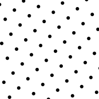
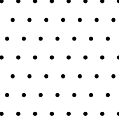
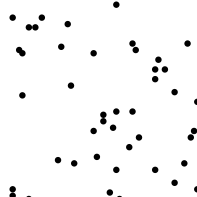
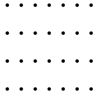
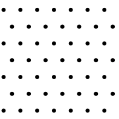
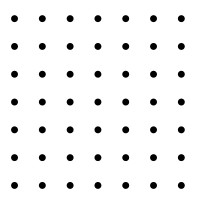
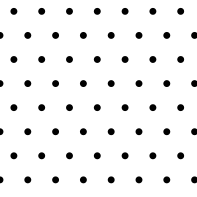

# Periodic and Aperiodic Lattices in $R^2$

Once upon a time I did some research into aperiodic crystals in the context of
photonic bandgaps.  I ended up needing some figures, and thought it fun to write
them directly in PostScript.

Here are the are five regular lattice types in $R^2$, known as [Bravis
lattices](https://en.wikipedia.org/wiki/Bravais_lattice).  They are (click on
the link to go to the source)

* [Oblique](#oblique)
* [Rectangular](#rectangular)
* [Rhomb](#rhomb)
* [Square](#square)
* [Triangular](#triangular)

Additionally, I provide the
[Fibonacci](http://www.cmth.ph.ic.ac.uk/people/a.mackinnon/Lectures/cp3/node81.html)
and the random lattice.

* [Fibonacci](#fibonacci)
* [Random](#random)

## Fibonacci

[Download Fibonacci PostScript](fib.eps)

~~~~ {.postscript}
%!PS-Adobe-3.0 EPSF-3.0
%%Creator: Created from bitmaplib by Paul Bourke
%%BoundingBox: 0 0 100 100
%%LanguageLevel: 2
%%Pages: 1
%%DocumentData: Clean7Bit

% size of lattice
/sx 100 def
/sy 100 def

% radius of object
/b 0.25 def

% object (a "circle") at each lattice point
/circle{
  gsave
  currentpoint translate
  newpath 0 0 b 0 360 arc fill stroke
  grestore
} def

% golden ration
/theta 1 5 sqrt add 2 div def

% returns the kth fibonacci number
/fib {
  dup theta exch exp 5 sqrt div exch neg theta neg exch exp 5 sqrt div sub cvi
} def

% proper mathematical modulo 1
/mod1 {
  dup truncate exch sub
} def

/k 18 def
/i 0 def
/n k fib def % how man iterations
sx sy translate
n {
  %100 i ne {
  i n div mod1 sx mul
  i n div k 1 sub fib mul mod1 sy mul
  moveto circle
  %} if
  /i i 1 add def
} repeat

showpage

%%EOF
~~~~

## Oblique

[Download Oblique PostScript](oblique.eps)

~~~~ {.postscript}
%!PS-Adobe-3.0 EPSF-3.0
%%Creator: Created from bitmaplib by Paul Bourke
%%BoundingBox: 0 0 100 100
%%LanguageLevel: 2
%%Pages: 1
%%DocumentData: Clean7Bit

% makes a triangular lattice

% lattice constant
/a 2 def

% radius of lattice entities
/r 0.25 def

% size of the grid x and y
/sx 100 def
/sy 100 def

% a circle shape exists at each lattice element
/circle{
  gsave
  currentpoint translate
  newpath 0 0 r 0 360 arc fill stroke
  grestore
} def

% go to an origin well below this dingle
sx neg 0 moveto
% iterate over all columns by the lattice constant
0 a sy 2 mul {
  a 0 rmoveto
  gsave
  % make the lattice diagonally
  0 a sx 3 sqrt mul { a 3 div a 5 sqrt 2 div mul rmoveto circle } for
  grestore
} for

%%EOF
~~~~

## Random

[Download Random PostScript](random.eps)

~~~~ {.postscript}
%!PS-Adobe-3.0 EPSF-3.0
%%Creator: Created from bitmaplib by Paul Bourke
%%BoundingBox: 0 0 100 100
%%LanguageLevel: 2
%%Pages: 1
%%DocumentData: Clean7Bit
%100 100 scale

% makes a square or rectangular lattice

% lattice constant
/ax 10 def
/ay 10 def

% radius of lattice entities
/r 1.00 def

% size of the grid x and y
/sx 100 def
/sy 100 def

/circle{
  gsave
  currentpoint translate
  newpath 0 0 r 0 360 arc fill stroke
  grestore
} def
newpath
0 0 moveto
0 sy lineto
sx sy lineto
sx 0 lineto
closepath clip
newpath
0 0 moveto
0 sy lineto
sx sy lineto
sx 0 lineto
closepath stroke

% go to origin
0 0 moveto
% columns
0 ay sy {
0 ax sx {
  gsave
  rand 100 mod rand 100 mod moveto circle
  grestore
} for
} for

showpage

%%EOF
~~~~

## Rectangular

[Download Rectangular PostScript](rect.eps)

~~~~ {.postscript}
%!PS-Adobe-3.0 EPSF-3.0
%%Creator: Created from bitmaplib by Paul Bourke
%%BoundingBox: 0 0 100 100
%%LanguageLevel: 2
%%Pages: 1
%%DocumentData: Clean7Bit
%100 100 scale

% makes a square or rectangular lattice

% lattice constant
/ax 2 def
/ay 4 def

% radius of lattice entities
/r 0.25 def

% size of the grid x and y
/sx 100 def
/sy 100 def

/circle{
  gsave
  currentpoint translate
  newpath 0 0 r 0 360 arc fill stroke
  grestore
} def

% go to origin
0 0 moveto
% columns
0 ay sy {
  0 ay rmoveto
  gsave
  % rows
  0 ax sx { ax 0 rmoveto circle } for
  grestore
} for

showpage

%%EOF
~~~~

## Rhomb

[Download Rhomb PostScript](rhomb.eps)

~~~~ {.postscript}
%!PS-Adobe-3.0 EPSF-3.0
%%Creator: Created from bitmaplib by Paul Bourke
%%BoundingBox: 0 0 100 100
%%LanguageLevel: 2
%%Pages: 1
%%DocumentData: Clean7Bit

% makes a triangular lattice

% lattice constant
/a 2 def

% radius of lattice entities
/r 0.25 def

% size of the grid x and y
/sx 100 def
/sy 100 def

% a circle shape exists at each lattice element
/circle{
  gsave
  currentpoint translate
  newpath 0 0 r 0 360 arc fill stroke
  grestore
} def

% go to an origin well below this dingle
sx neg 0 moveto
% iterate over all columns by the lattice constant
0 a sy 2 mul {
  a 0 rmoveto
  gsave
  % make the lattice diagonally
  0 a sx 2 mul { a 2 div a rmoveto circle } for
  grestore
} for

%%EOF
~~~~

## Square

[Download Square PostScript](square.eps)

~~~~ {.postscript}
%!PS-Adobe-3.0 EPSF-3.0
%%Creator: Created from bitmaplib by Paul Bourke
%%BoundingBox: 0 0 100 100
%%LanguageLevel: 2
%%Pages: 1
%%DocumentData: Clean7Bit
%100 100 scale

% makes a square or rectangular lattice

% lattice constant
/ax 2 def
/ay 2 def

% radius of lattice entities
/r 0.25 def

% size of the grid x and y
/sx 100 def
/sy 100 def

/circle{
  gsave
  currentpoint translate
  newpath 0 0 r 0 360 arc fill stroke
  grestore
} def

% go to origin
0 0 moveto
% columns
0 ay sy {
  0 ay rmoveto
  gsave
  % rows
  0 ax sx { ax 0 rmoveto circle } for
  grestore
} for

showpage

%%EOF
~~~~

## Triangular

[Download Triangular PostScript](triangle.eps)

~~~~ {.postscript}
%!PS-Adobe-3.0 EPSF-3.0
%%Creator: Created from bitmaplib by Paul Bourke
%%BoundingBox: 0 0 100 100
%%LanguageLevel: 2
%%Pages: 1
%%DocumentData: Clean7Bit

% makes a triangular lattice

% lattice constant
/a 2 def

% radius of lattice entities
/r 0.25 def

% size of the grid x and y
/sx 100 def
/sy 100 def

% a circle shape exists at each lattice element
/circle{
  gsave
  currentpoint translate
  newpath 0 0 r 0 360 arc fill stroke
  grestore
} def

% go to an origin well below this dingle
sx neg 0 moveto
% iterate over all columns by the lattice constant
0 a sy 2 mul {
  a 0 rmoveto
  gsave
  % make the lattice diagonally
  0 a sx 3 sqrt mul { a 2 div a 3 sqrt 2 div mul rmoveto circle } for
  grestore
} for

%%EOF
~~~~
